# CIFAR10 Dataset Classification
## INTRODUCTION
The CIFAR-10 dataset consists of 60000 32x 32 color images in 10 classes, with 6000 images per class. There are 50000 training images and 10000 test images.  

Figure below provides a glimpse into 10 random images from each class.  

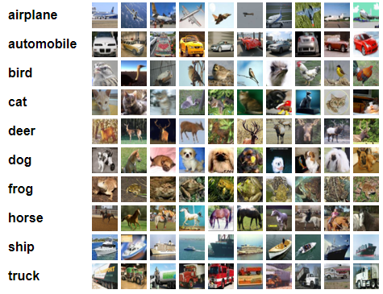  

In this project, I use Keras with TensorFlow backend to develop a Convolutional Neural Networks (CNN or ConvNet) to classify CIFAR-10 dataset into its predefined 10 classes, i.e. airplane, automobile, bird, cat, deer, dog, frog, horse, ship and truck.  

The images need to be normalized to scale our input training vectors to be used for updating weights in each backpropagation to reduce error. The labels need to be one-hot encoded as well.  

### Initializing Hyperparameters
I feed the CNN with the images as batches of 64 images in a variation of 20, 50 and 100 epochs to analyze the loss and accuracy. The model will output the probabilities of 10 different categories (num_class).  

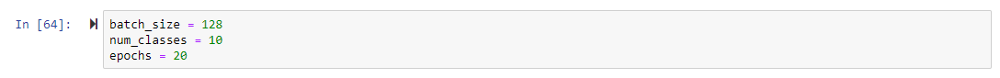  

I also explicitly define our CIFAR-10 image dimensions which will be used later to reshape our data.  

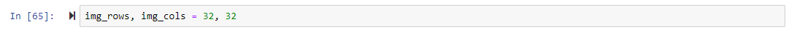  

## DATA PRE-PROCESSING
As I want the Keras modules to be compatible with both Theano (th) and TensorFlow (tf), I have to write them via the abstract Keras backend API.  

The input shape that a CNN accepts should be in a specific format, i.e.
  - For Tensorflow, the format should be (`batch`, `height`, `width`, `channels`). 
  - For Theano, the format should be (`batch`, `channels`, `height`, `width`).

The code snippet below reshapes our input into the correct format depending on the backend we are using `K.image_data_format()` returns `channels_first` or `channels_last` string depending the backend you are using. In this case, our Tensorflow backend returns `channels_last`.  

As the dataset consists of color images, then the number of channels would be 3 (R, G, B).  

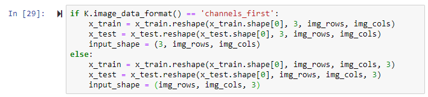  

As shown below, the labels in the dataset are converted into categorical matrix structure from 1-dim numpy array structure using `keras.utils.to_categorical`(`y`, `num_classes=None`, `dtype='float'`).  

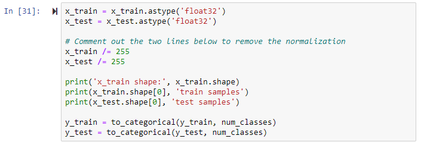  

## MODEL

CNN consists of convolutional layers which learn features from images.  

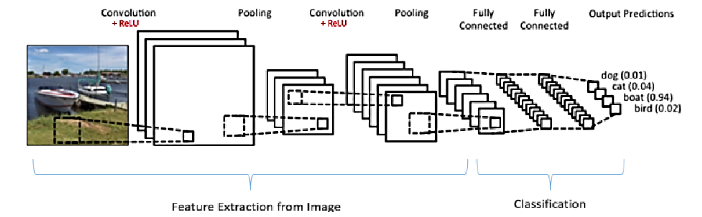

Essentially, there are four major steps in CNN, i.e.  
  - Convolution
  - Non-Linearity
  - Pooling
  - Classification

I build my model based on the typical CNN architecture as mentioned above.  

Figure below shows the summary of the model in my Jupyter Notebook.  

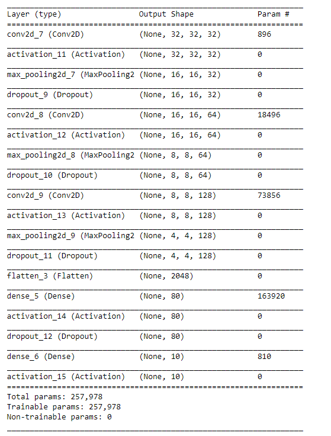

### Optimization using Stochastic Gradient Descent Algorithm
SGD is used to optimize the weights on the backpropagation. Momentum parameter is set as 0.9 and other parameters are left as default.  

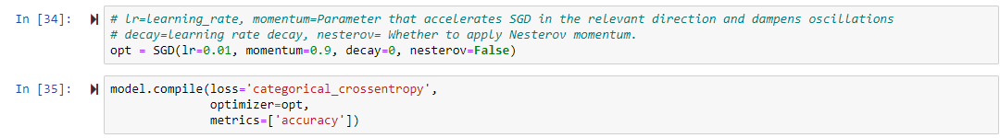

### Training the Model
I split the training dataset (50000 images) into training (45000 images) and validation (5000 images) datasets to measure the validation accuracy of our model. Thus, the neural network model will continue the training by evaluating the images that are not been during the training after each epoch.  

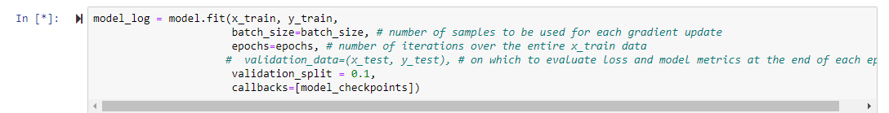

## RESULTS and ANALYSIS
Below we plot out the trend of the accuracy and loss of both the training set and validation set.  

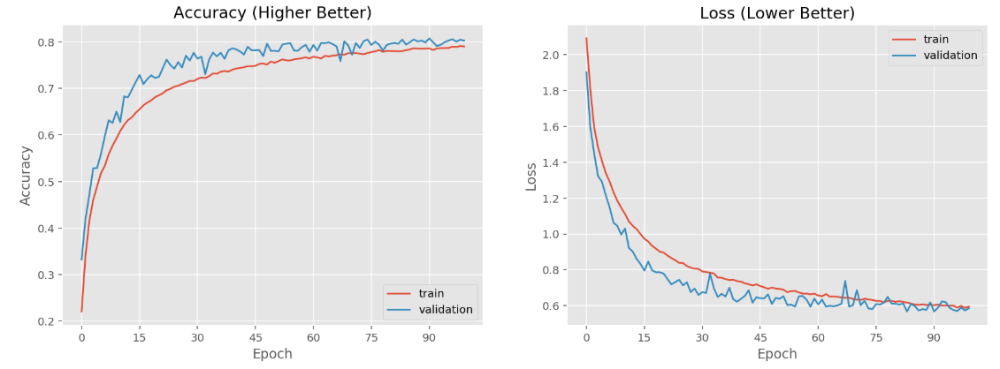

### Results
20 epochs - Accuracy: 70.15%, Loss: 0.85, Time Taken: 2499.88 seconds  
50 epochs - Accuracy: 76.81%, Loss: 0.67, Time Taken: 7136.12 seconds   
100 epochs - Accuracy: 78.97%, Loss: 0.61, Time Taken: 16605.46 seconds  

From the results, it is obvious that higher epochs lead to better performance.  

## CONCLUSION
Overall, there are a number of improvements I’d have if given more time:  
1. Visualization of wrongly classified data – I got a memory error while printing error_x’s shape as shown below.  
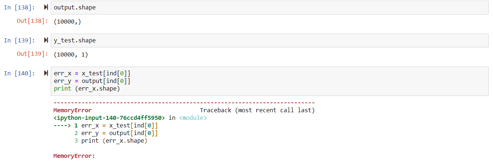
2. Changing Optimizer - We can use other algorithm to optimize the weights and observe the results.   
3. Changing Learning Rate - We can decrease/increase the learning rate and observe the results.  

